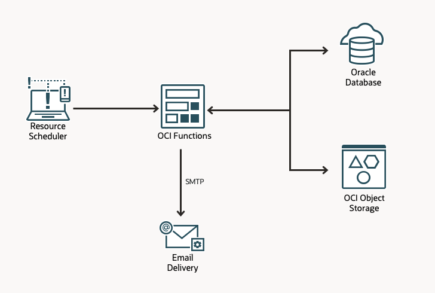

# Oracle Database TxEventQ and OCI Serverless

## Overview

This project demonstrates an event-driven architecture using Oracle Database TxEventQ and OCI Serverless Functions to process messages, store content, and deliver notifications.

## Business Value

**Problem**: Organizations need to process queued messages, store their content securely, and deliver them to stakeholders via email with secure download links.

**Solution**: An automated serverless pipeline that:

- Dequeues messages from Oracle Database TxEventQ
- Stores content in Object Storage
- Generates secure Pre-Authenticated Request (PAR) links
- Sends HTML-formatted email notifications with download links
- Runs periodically without manual intervention

**Benefits**:

- Serverless architecture with pay-per-use pricing
- Scalable message processing with batching
- Secure content delivery with time-limited PAR links
- Dual-mode operation (local development + cloud production)

## Business Concepts

### Message Queue (TxEventQ)

Messages are enqueued in Oracle Database TxEventQ with a simple JSON payload:

```json
{
  "title": "Monthly Sales Report",
  "content": "Sales data for January 2025...",
  "date": "2025-01-15T10:30:00Z"
}
```

### Content Storage

- **Local**: Files saved to local directory for development/testing
- **Cloud**: Files uploaded to OCI Object Storage with secure PAR links

### Delivery

HTML-formatted emails with:

- Report title and date
- Secure download link (PAR)
- Professional email template

### Automation

OCI Resource Scheduler triggers the function periodically (configurable via CRON expression) to process pending messages.

## Architecture

### High-Level Flow



### Components

**Database Layer**:

- Oracle Database FREE 23ai (local) or Autonomous Database 23ai (cloud)
- TxEventQ for message queuing
- JSON payload type
- DRCP for connection pooling (cloud only)

**Function Layer**:

- Java 23 serverless function
- Fn Project runtime (local) or OCI Functions (cloud)
- Batch processing (up to 20 messages)
- 3-minute timeout

**Storage Layer**:

- Local filesystem (development)
- OCI Object Storage (production)
- Pre-Authenticated Requests for secure access

**Notification Layer**:

- SMTP-based email delivery
- Mailpit (local testing)
- Customer SMTP server (production)

**Orchestration Layer** (Cloud only):

- OCI Resource Scheduler (CRON-based scheduling)
- Direct function invocation (no intermediate notification service)

## Design Principles

1. **Simplicity**: Direct approach optimized for POC, not enterprise scale
2. **Dual-Mode**: Same codebase runs locally and in cloud
3. **Cost Optimization**: Minimize resource consumption for enterprise POC
4. **Security**: Wallet-based authentication, secure PAR links
5. **Observability**: Structured logging, metrics, alarms

## Technology Stack

- **Language**: Java 23
- **Build**: Gradle
- **Database**: Oracle Database FREE 23ai / Autonomous Database 23ai
- **Queue**: Oracle TxEventQ
- **Function**: Fn Project / OCI Functions
- **Storage**: Local filesystem / OCI Object Storage
- **IaC**: Terraform
- **Containers**: Podman

## Getting Started

This project supports two deployment modes:

### Local Development

For development, testing, and iteration without OCI costs.

→ **[LOCAL.md](LOCAL.md)** - Step-by-step guide for local deployment

### Cloud Production

For production deployment on Oracle Cloud Infrastructure.

→ **[CLOUD.md](CLOUD.md)** - Step-by-step guide for cloud deployment

## Project Structure

```
.
├── README.md              # This file - overview and architecture
├── LOCAL.md               # Local deployment guide
├── CLOUD.md               # Cloud deployment guide
├── REQUIREMENTS.md        # Detailed requirements
├── ARCHITECTURE.md        # Detailed architecture
├── IMPLEMENTATION.md      # Complete implementation reference
├── CONSTRAINTS.md         # Project constraints and scope
├── NOTES.md               # Additional notes
├── db/                    # Database scripts
├── function/              # Function source code
└── terraform/             # Infrastructure as Code
```

## Additional Documentation

- **[REQUIREMENTS.md](REQUIREMENTS.md)** - Functional and non-functional requirements
- **[ARCHITECTURE.md](ARCHITECTURE.md)** - Detailed system architecture
- **[IMPLEMENTATION.md](IMPLEMENTATION.md)** - Complete implementation details
- **[CONSTRAINTS.md](CONSTRAINTS.md)** - Project scope and constraints

## License

Enterprise Proof of Concept
